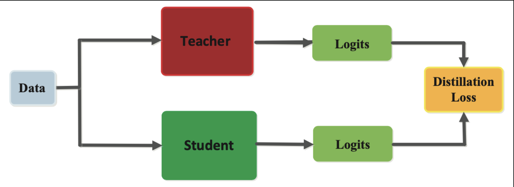

# The usage of knowledge distillation on image classification problem
Author: Vuong Gia Huy

## What is knowledge distillation?
- Knowledge distillation is a machine learning technique that allows a small model to learn from a larger, more complex model. The larger model, called the teacher, is trained on a large dataset and learns to make accurate predictions. The smaller model, called the student, is trained on a smaller dataset and learns to make predictions that are similar to those of the teacher.
- Knowledge distillation works by using the teacher model to create a soft target for the student model. The soft target is a probability distribution over the possible classes, rather than a single class label. The student model learns to match the soft target, which helps it to learn more robust and generalizable features.
- Knowledge distillation has been shown to be effective in a variety of tasks, including image classification, natural language processing, and speech recognition. It can be used to train smaller, more efficient models that are still able to make accurate predictions.
<p align="center">
  
</p>
<p align="center">
  <a href="https://arxiv.org/abs/2006.05525">Source</a>
</p>

## Why do need we need it?
- It can be used to train smaller, more efficient models.
- It can help models to learn more robust and generalizable features.
- It can improve the accuracy of models on unseen data.

## Some of the challenges of knowledge distillation
- It can be difficult to find a good teacher model.
- The student model may not be able to learn all of the knowledge from the teacher model.
- Knowledge distillation can be computationally expensive.

## Dataset

An example of applying the knowledge distillation technique on an image classification problem. In this repo, i used the dataset of `SAMUEL CORTINHAS` ([link](https://www.kaggle.com/datasets/samuelcortinhas/sports-balls-multiclass-image-classification)) on kaggle. I had balanced this dataset before i applied for training with knowledge distillation technique.

## Installation
```
pip install -r requirements.txt
```

## Download data
You can go to this [link](https://www.kaggle.com/datasets/sshikamaru/fruit-recognition) to download fruit dataset.